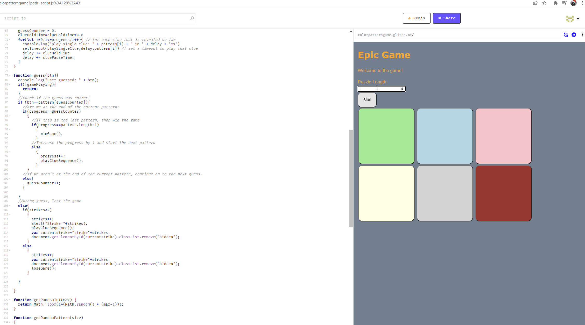

# Pre-work - *Memory Game*

**Memory Game** is a Light & Sound Memory game to apply for CodePath's SITE Program. 

Submitted by: Jason Tran

Time spent: 4 hours spent in total

Link to project: https://glitch.com/edit/#!/colorpatterngame
or https://colorpatterngame.glitch.me/

## Required Functionality

The following **required** functionality is complete:

* [x] Game interface has a heading (h1 tag), a line of body text (p tag), and four buttons that match the demo app
* [x] "Start" button toggles between "Start" and "Stop" when clicked. 
* [x] Game buttons each light up and play a sound when clicked. 
* [x] Computer plays back sequence of clues including sound and visual cue for each button
* [x] Play progresses to the next turn (the user gets the next step in the pattern) after a correct guess. 
* [x] User wins the game after guessing a complete pattern
* [x] User loses the game after an incorrect guess

The following **optional** features are implemented:

* [ ] Any HTML page elements (including game buttons) has been styled differently than in the tutorial
* [x] Buttons use a pitch (frequency) other than the ones in the tutorial
* [x] More than 4 functional game buttons
* [x] Playback speeds up on each turn
* [x] Computer picks a different pattern each time the game is played
* [x] Player only loses after 3 mistakes (instead of on the first mistake)
* [ ] Game button appearance change goes beyond color (e.g. add an image)
* [ ] Game button sound is more complex than a single tone (e.g. an audio file, a chord, a sequence of multiple tones)
* [ ] User has a limited amount of time to enter their guess on each turn

The following **additional** features are implemented:

- [x] List anything else that you can get done to improve the app!
- Added a feature so that the player can choose the length of the pattern (even 1) but if the user enters nothing then it defaults to a length of 6
## Video Walkthrough (GIF)

If you recorded multiple GIFs for all the implemented features, you can add them here:

## Reflection Questions
1. If you used any outside resources to help complete your submission (websites, books, people, etc) list them here. 
*https://www.w3schools.com/tags/att_button_disabled.asp
*https://www.w3schools.com/tags/tag_input.asp

2. What was a challenge you encountered in creating this submission (be specific)? How did you overcome it? (recommended 200 - 400 words) 
The part that gave me some was trying to implement the three strike system feature. At first I was having trouble find how to display the strikes nicely. Plain text
seemed a bit plain so I tried to find a way to implement this green checkmark symbol for each of the strikes. However, it seemed a bit complicate since there were apparently special key values for the symbol which I didn't understand how to use. Therefore, I decided to just switch to using buttons with an X in the middle since that was just made up of concepts that I had just learned from the required prework and also disabled them so the user wouldn't start clicking on them. I then reworked the script.js file to account for the strikes, but when I tried running it, the whole program stopped working. I tried resolving this by cutting out some of the new code that I had just added until it finally started working again, though without the 3 strike system working. At first I thought the strike count was not working so I added an alert to show the number of strikes which was apparently working correctly. I slowly added code back in until the whole program stopped working again, which happened when I tried to make the strike boxes dissappear and reappear. Since I didn't anything wrong with the js code, I check the html file and it turned out that instead of assigning each button an id, I had assigned them a type. So I switched type to id and it finally worked.

3. What questions about web development do you have after completing your submission? (recommended 100 - 300 words) 
[YOUR ANSWER HERE]

4. If you had a few more hours to work on this project, what would you spend them doing (for example: refactoring certain functions, adding additional features, etc). Be specific. (recommended 100 - 300 words) 
[YOUR ANSWER HERE]

## Interview Recording URL Link

[My 5-minute Interview Recording](your-link-here)

## License

    Copyright [YOUR NAME]

    Licensed under the Apache License, Version 2.0 (the "License");
    you may not use this file except in compliance with the License.
    You may obtain a copy of the License at

        http://www.apache.org/licenses/LICENSE-2.0

    Unless required by applicable law or agreed to in writing, software
    distributed under the License is distributed on an "AS IS" BASIS,
    WITHOUT WARRANTIES OR CONDITIONS OF ANY KIND, either express or implied.
    See the License for the specific language governing permissions and
    limitations under the License.
